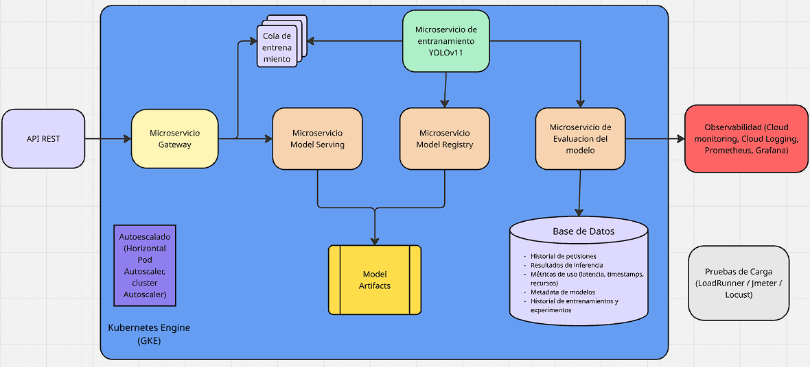

# OpenTofu (GCS-Computer-Vision)

Este modulo de OpenTofu crea y despliega toda la infraestructura necesaria para correr la aplicacion:

- Bucket GCS para dataset y artefactos
- Service accounts y permisos
- Secret Manager (GCP_SA_B64 y VAST_SSH_KEY)
- VM de aplicacion con startup script
- VM de observabilidad (Grafana + Loki + Prometheus + cAdvisor + node-exporter)
- Cloud SQL Postgres
- Upload de `docker-compose.yml` y `app_bundle.tar.gz` al bucket

La aplicacion se levanta automaticamente en la VM usando el bundle.

## Arquitectura del proyecto



## Requisitos

- OpenTofu instalado
- gcloud autenticado en el proyecto
- Acceso a Vast.ai (API key y SSH key)
- Dataset `taco.tar.gz` disponible en `dataset/`

## Paso a paso (deploy completo)

1. SSH key para Vast (solo una vez):
   - Ejecutar en Windows:
     ```
     .\scripts\vast_ssh_setup.ps1 -Project unlu-genai-serranodavid
     ```
   - La clave publica debe estar en Vast.ai -> Account -> SSH Keys.
   - Esto hoy no esta automatizado en Vast.ai, es un paso manual unico (no en cada deploy).

2. Bundle de la app:
   - El `app_bundle.tar.gz` lo provee el equipo.

3. Aplicar OpenTofu:
   - Ejecutar en `opentofu/dev`:
     ```
     tofu apply
     ```

4. Esperar a que la VM termine el startup:
   - Conectarse por SSH a la VM.
   - Revisar logs:
     ```
     sudo tail -n 200 /var/log/startup-script.log
     ```

## Validaciones rapidas en la VM

- GCP JSON:
  ```
  sudo ls -l /opt/app/secrets/gcp.json
  sudo head -n 1 /opt/app/secrets/gcp.json
  ```

- VAST SSH key:
  ```
  sudo ssh-keygen -yf /opt/app/secrets/vast_ed25519 >/dev/null && echo HOST_OK || echo HOST_FAIL
  ```

- Contenedor training-worker:
  ```
  cd /opt/app/src
  docker compose -f infra/docker/docker-compose.local.yml -f infra/docker/docker-compose.override.yml exec -T training-worker \
    sh -lc 'ssh-keygen -yf /root/.ssh/id_ed25519 >/dev/null && echo CT_OK || echo CT_FAIL'
  ```

## Observabilidad (Grafana/Loki)

La VM de observabilidad se aprovisiona automaticamente con:
- Datasource Loki
- Dashboards en `/opt/obs/grafana/dashboards/`

Si actualizas dashboards/provisioning, recrea la VM:
```
tofu taint google_compute_instance.obs_vm[0]
tofu apply
```

### Acceso a Grafana

- URL: `http://<IP_PUBLICA_OBS_VM>:3000`
- Usuario: `admin`
- Password: valor de `obs_grafana_admin_password` en `terraform.tfvars`

### Labels reales de logs

Promtail publica labels como `host`, `service`, `container`, `compose_project`, `container_id`.
No existe label `job` por defecto.

Ejemplos en Grafana (LogQL):
```
{host="cv-app-vm", service="api-gateway"}
{host="cv-app-vm", service="training-worker"}
{host="cv-app-vm", service="model-serving"}
{host="cv-app-vm", service="model-registry"}
```

## Cambios en la app

Si hiciste cambios en el repo de la app:

1. Regenerar el bundle (paso 2).
2. Volver a aplicar:
   ```
   tofu apply
   ```

## Secrets

- `GCP_SA_B64` se obtiene desde Secret Manager y se transforma en `/opt/app/secrets/gcp.json`.
- `VAST_SSH_KEY` se escribe en `/opt/app/secrets/vast_ed25519`.
- `VAST_API_KEY` se inyecta al runtime y es requerido por el worker.

### Secrets requeridos (paso a paso)

1. `VAST_SSH_KEY` (clave privada OpenSSH):
   ```
   .\opentofu\dev\scripts\vast_ssh_setup.ps1 -Project unlu-genai-serranodavid
   ```

2. `VAST_API_KEY`:
   ```
   $apiKey = "TU_VAST_API_KEY"
   $tmp = New-TemporaryFile
   $apiKey | Set-Content -NoNewline $tmp
   gcloud secrets create VAST_API_KEY --replication-policy=automatic --project unlu-genai-serranodavid 2>$null
   gcloud secrets versions add VAST_API_KEY --data-file $tmp --project unlu-genai-serranodavid | Out-Null
   Remove-Item $tmp
   ```

3. `DB_PASSWORD`:
   ```
   $dbPass = "TU_PASSWORD_BD"
   $tmp = New-TemporaryFile
   $dbPass | Set-Content -NoNewline $tmp
   gcloud secrets create DB_PASSWORD --replication-policy=automatic --project unlu-genai-serranodavid 2>$null
   gcloud secrets versions add DB_PASSWORD --data-file $tmp --project unlu-genai-serranodavid | Out-Null
   Remove-Item $tmp
   ```

4. `GCP_SA_B64`:
   - Se crea automaticamente con OpenTofu.

## Destruir todo menos el secreto GCP_SA_B64
```
tofu state rm --% google_secret_manager_secret.gcp_sa_b64[0] google_secret_manager_secret_version.gcp_sa_b64[0]
tofu destroy
```

## Conectar a Cloud SQL desde pgAdmin

1. Ir a Cloud SQL -> Instancia -> Conexiones.
2. Agregar tu IP publica en "Redes autorizadas".
3. En pgAdmin usar:
   - Host: IP publica de la instancia
   - Puerto: 5432
   - DB: computer-vision
   - Usuario: sauron
   - Password: ComunidadDelAnillo92
